# DVWA User and Password Enumeration via Brute Force

## Objective
Identify all 5 DVWA users and their passwords using fuzzing and brute-force techniques, with `security` set to `low`. Tools used: Burp Suite (Intruder), ffuf, and wfuzz.

## Environment
- Attacker machine: Kali Linux (QEMU/KVM VM)
- Target: DVWA running on `127.0.0.1`
- DVWA security level: Low

## Step 1 — Recon with Burp Suite

Before fuzzing anything, I proxied my browser through Burp Suite and walked through a normal DVWA login and brute-force attempt to understand the request/response structure.

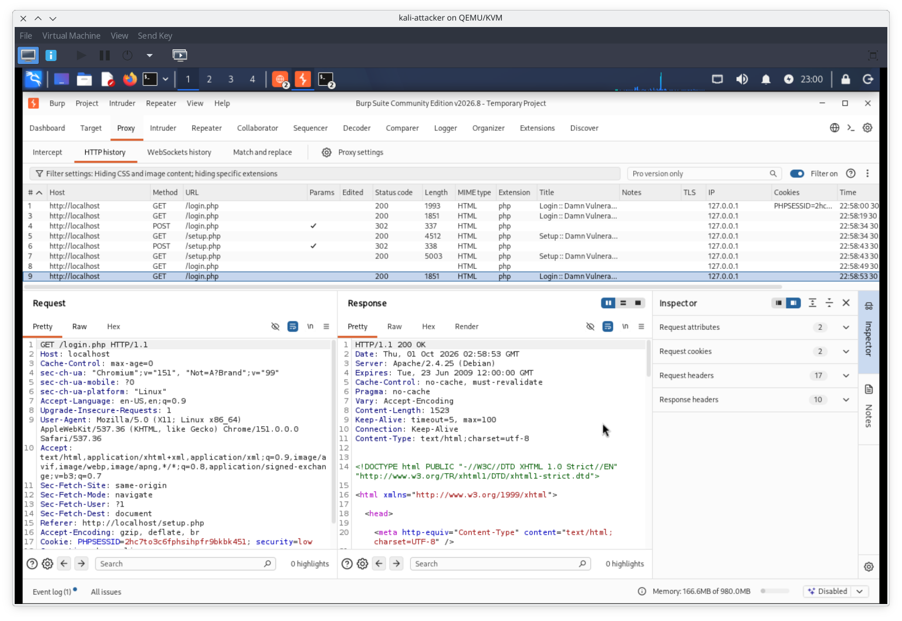

Logging in and visiting the Brute Force page showed the request was a simple GET with `username`, `password`, and `Login` parameters, and that DVWA tracks the session via a `PHPSESSID` cookie plus a `security=low` cookie.

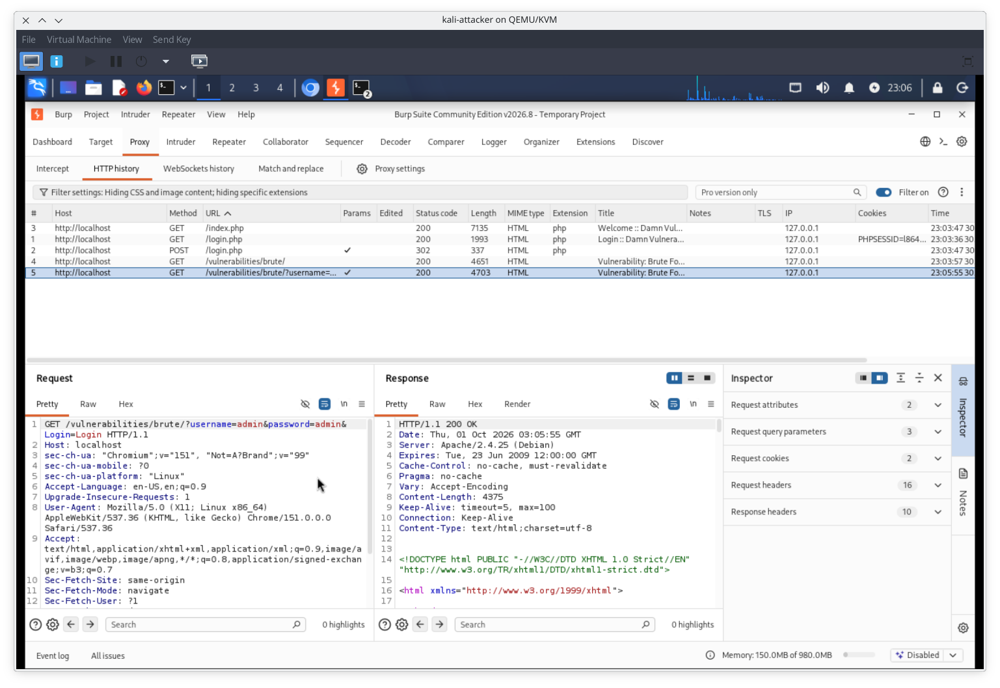

Key finding: DVWA's Brute Force page **always returns HTTP 200**, regardless of whether the login succeeds or fails. The only way to tell success from failure is by inspecting the response body — a failed attempt contains the string `"Username and/or password incorrect."`, while a successful one shows a welcome message and has a different content length. This meant none of my fuzzing could rely on status codes; everything had to filter on response content/length instead.

## Step 2 — Username enumeration attempt via the login form (did not work)

My first instinct was to fuzz the `username` parameter directly against the login page:

```bash
ffuf -u "http://127.0.0.1/DVWA/vulnerabilities/brute/?username=FUZZ&password=x&Login=Login"
-w /usr/share/seclists/Usernames/top-usernames-shortlist.txt
-b "PHPSESSID=l864u3i9b30ilqbco0itqe1a40; security=low"
-fr "Username and/or password incorrect"
```

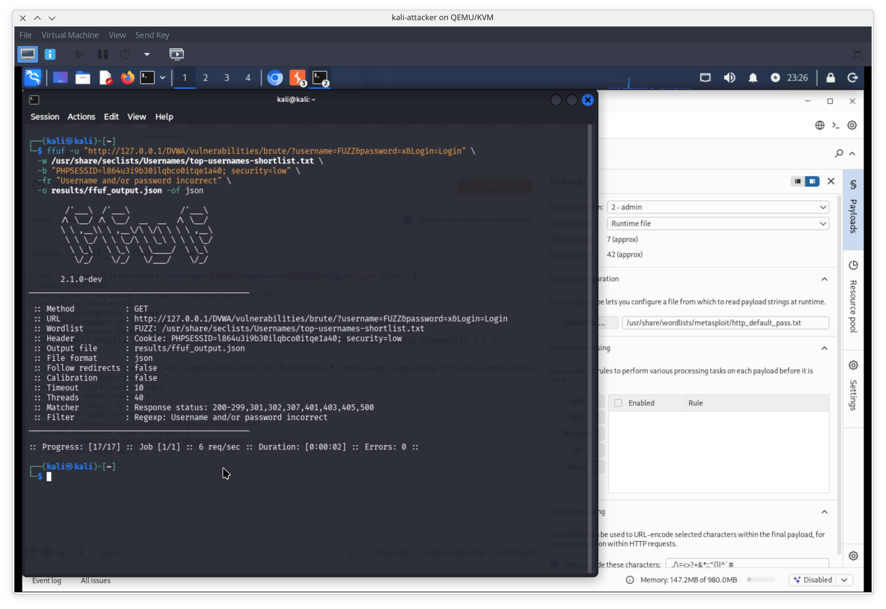

This produced no usable signal, because DVWA's Brute Force module gives the exact same generic "incorrect" message whether the username, the password, or both are wrong. There's no username-vs-password distinction in the response, so this approach couldn't isolate valid usernames.

This run also revealed a path issue: I was initially using `/DVWA/vulnerabilities/brute/`, but later confirmed via Burp (see Step 5) that the correct path on this install is `/vulnerabilities/brute/`, with no `/DVWA/` prefix.

## Step 3 — Username enumeration via the image/avatar endpoint (worked)

DVWA ships a profile image for each valid user under `/hackable/users/<username>.jpg`. Fuzzing that path directly, and filtering on HTTP 200 (a real image) vs 404 (no such user), is a much more reliable signal.

**First attempt — small shortlist wordlist:**

```bash
ffuf -u "http://127.0.0.1/hackable/users/FUZZ.jpg"
-w /usr/share/seclists/Usernames/top-usernames-shortlist.txt
-b "PHPSESSID=l864u3i9b30ilqbco0itqe1a40; security=low"
-mc 200
-o results/ffuf_userimg_output.json -of json
```

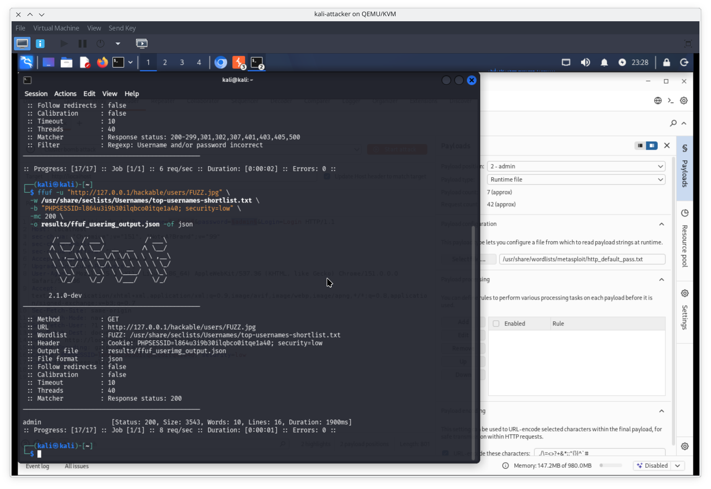

This only found `admin`, because DVWA's other usernames (`gordonb`, `1337`, `pablo`, `smithy`) are intentionally unusual and don't appear in a generic "common usernames" list.

**Second attempt — large real-world wordlist (xato-net, ~8.3 million entries):**

```bash
ffuf -u "http://127.0.0.1/hackable/users/FUZZ.jpg"
-w /usr/share/seclists/Usernames/xato-net-10-million-usernames.txt
-b "PHPSESSID=l864u3i9b30ilqbco0itqe1a40; security=low"
-mc 200
-o results/ffuf_userimg_output2.json -of json
```

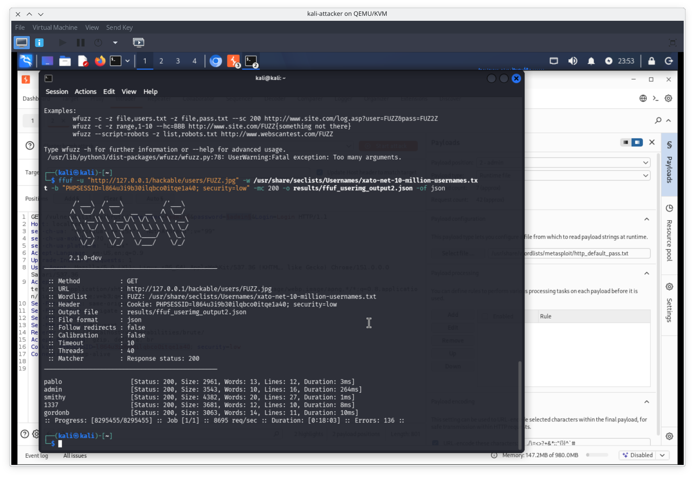

This scan took about 18 minutes (8,295,455 requests) and successfully found all 5 DVWA usernames:

| Username | Response Size | Duration |
|----------|---------------|----------|
| admin    | 3543 bytes    | 264ms    |
| pablo    | 2961 bytes    | 3ms      |
| smithy   | 4382 bytes    | 1ms      |
| 1337     | 3681 bytes    | 8ms      |
| gordonb  | 3063 bytes    | 10ms     |

**Lesson learned:** a bigger wordlist isn't automatically better — a small, well-targeted list is faster and often sufficient, but DVWA's deliberately unusual usernames meant only a very large, real-world-derived list happened to contain all 5.

## Step 4 — Password brute-forcing with Burp Intruder (admin)

While working out wfuzz path/syntax issues, I used Burp Suite's Intruder to brute-force the `admin` password in parallel.

**Sniper attack — username only, confirming the brute force endpoint behavior:**
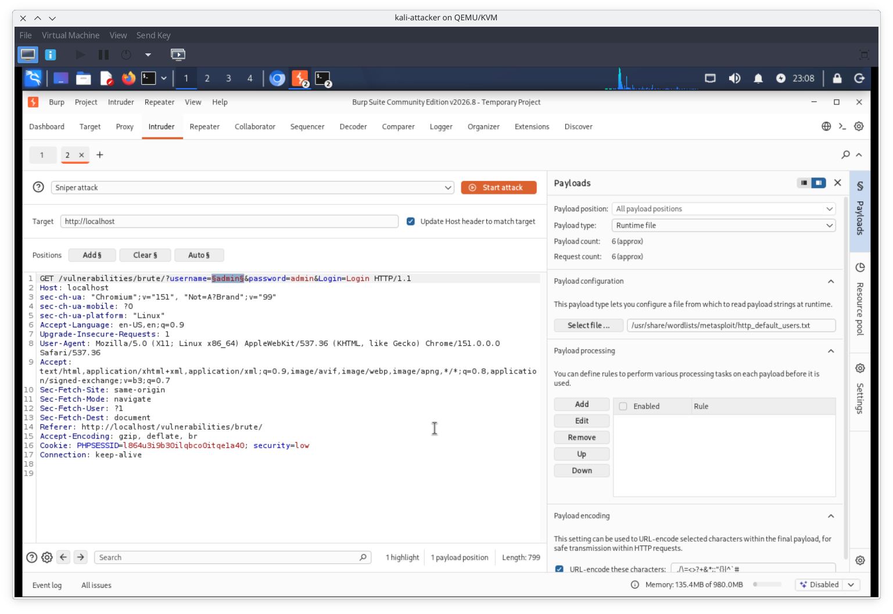
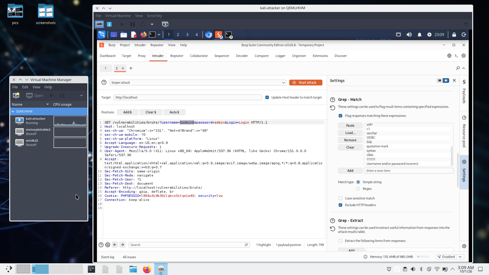

I configured a Grep-Match rule to flag any response containing `"Username and/or password incorrect"`, so successful logins would stand out as the *unflagged* rows.

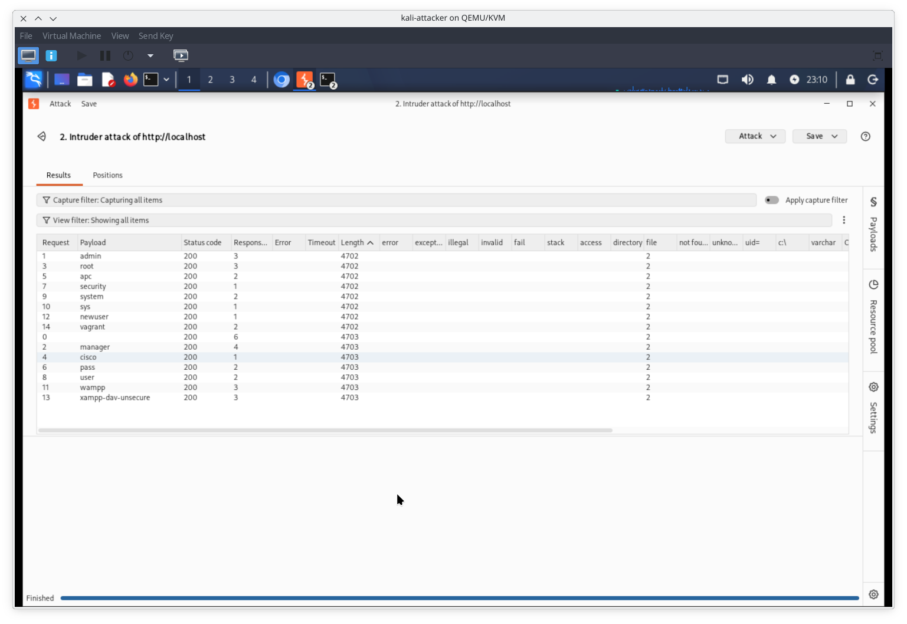

**Cluster bomb attack — both username and password fuzzed simultaneously:**
Payload 1 (username): /usr/share/wordlists/metasploit/http_default_users.txt
Payload 2 (password): /usr/share/wordlists/metasploit/http_default_pass.txt


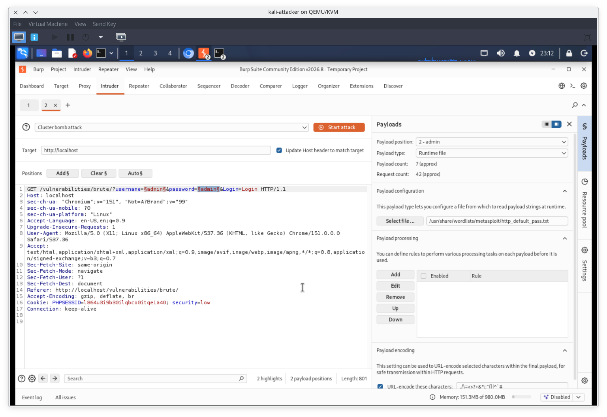

Sorting the results by response **Length** made the successful login obvious: nearly every row returned the same length (4703, the standard "incorrect" response), but one row — `admin` / `password` — returned **4740 bytes**, a clear outlier indicating a successful login.

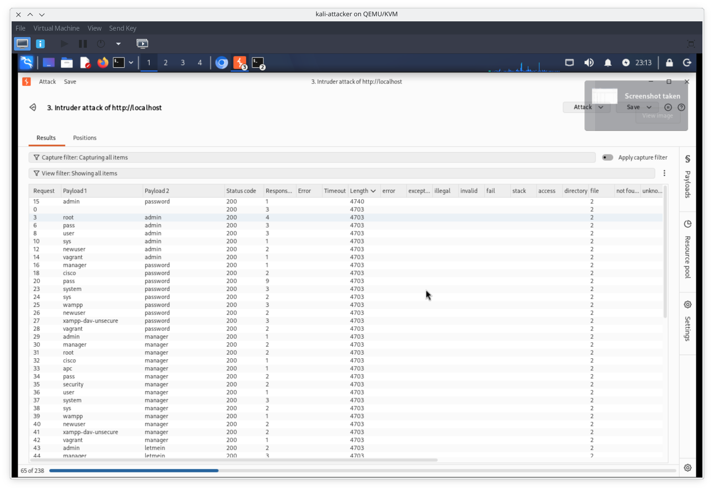

**Confirmed:** `admin` : `password` — found via Burp Intruder cluster bomb attack, `/usr/share/wordlists/metasploit/http_default_pass.txt`.

## Step 5 — wfuzz troubleshooting and corrected path

Two issues came up while setting up wfuzz for the remaining 4 accounts:

1. **Wrong output flag syntax** — wfuzz's `-o` expects a format keyword, not a file path; the correct way to save output is `-f <path>,<format>`. Initial attempts using `-o results/file.json` threw "Too many arguments."
2. **Wrong URL path** — early wfuzz runs against `/DVWA/vulnerabilities/brute/` returned blanket 404s. I confirmed via Burp Proxy history that `/DVWA/vulnerabilities/brute/` returns 404, while `/vulnerabilities/brute/` (no prefix) returns 200 — this DVWA install serves from the web root directly.

Once corrected, the wfuzz command pattern used for all remaining accounts was:

wfuzz -c -z file,/usr/share/wordlists/seclists/Passwords/Common-Credentials/Pwdb_top-1000.txt
-b "PHPSESSID=l864u3i9b30ilqbco0itqe1a40; security=low"
--hs "Username and/or password incorrect"
-f results/wfuzz_<username>.json,json
"http://127.0.0.1/vulnerabilities/brute/?username=<username>&password=FUZZ&Login=Login"


**pablo** — hit on first attempt:
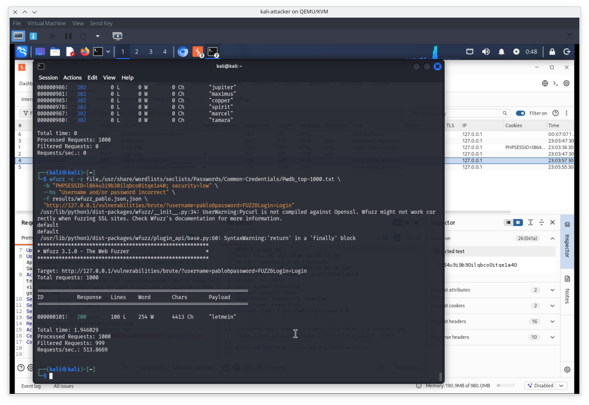
Password: `letmein`, found in `Pwdb_top-1000.txt`.

**smithy** — hit on first attempt:

Password: `password`, found in `Pwdb_top-1000.txt`.

**gordonb** — hit on first attempt:

Password: `abc123`, found in `Pwdb_top-1000.txt`.

**1337** — no hit in `Pwdb_top-1000.txt` (999/1000 filtered, 0 survivors). Escalated to `Pwdb_top-10000.txt`:
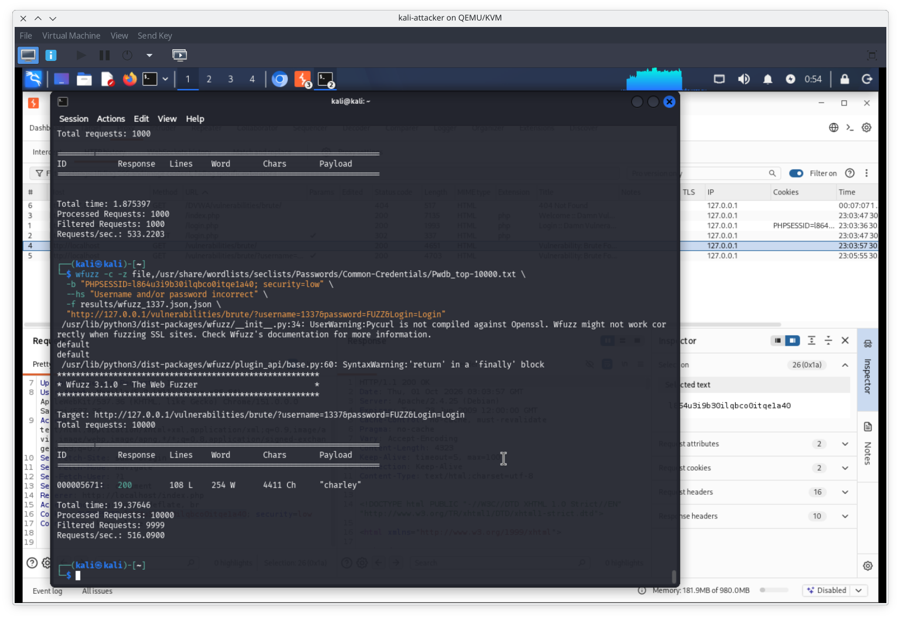
Password: `charley`, found in `Pwdb_top-10000.txt` after the smaller list failed to surface it.

## Step 6 — Manual verification of all 5 credentials

Each username/password pair was manually tested on DVWA's login page and confirmed with a "Welcome to the password protected area `<username>`" message.

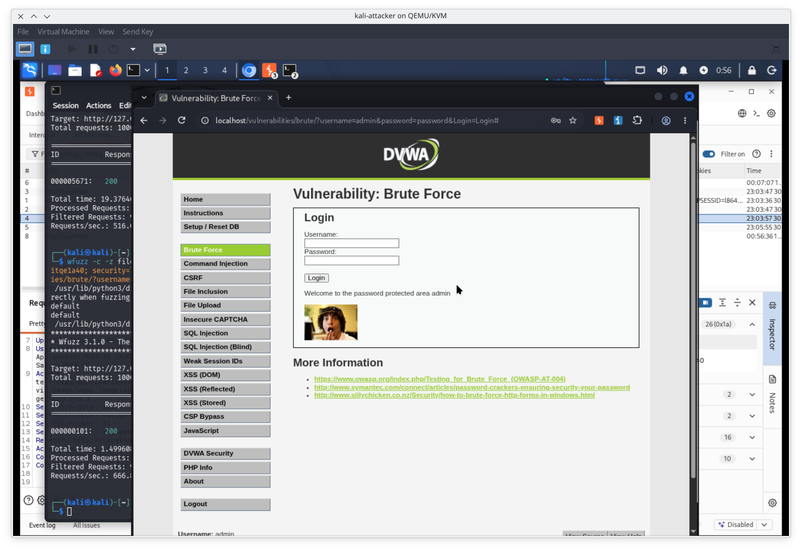
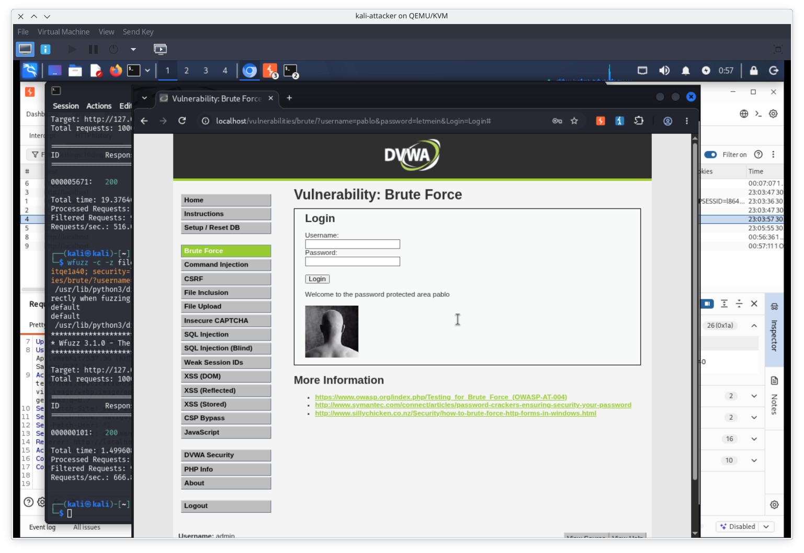
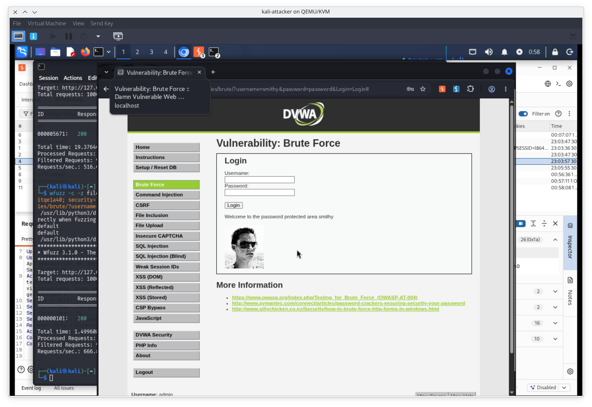
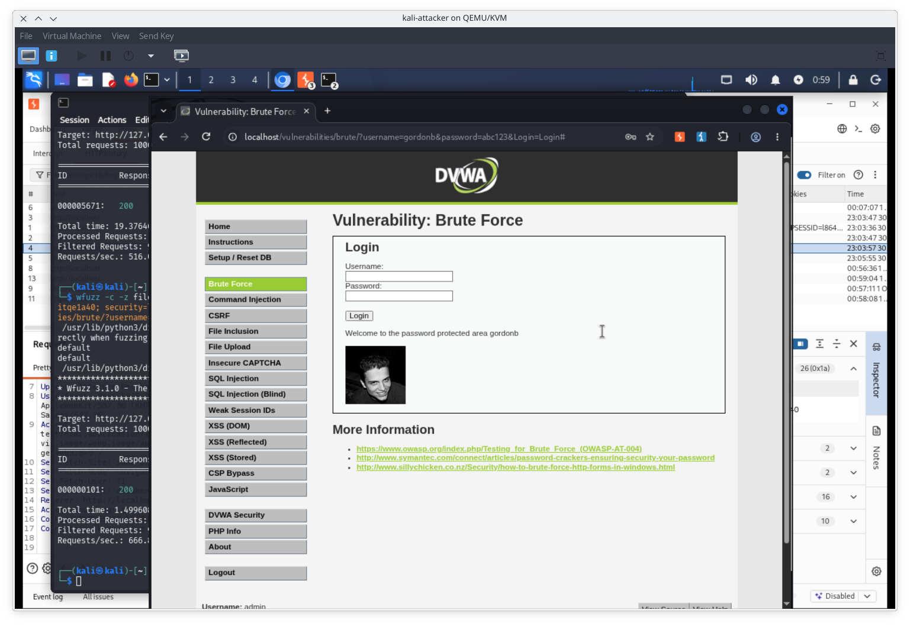
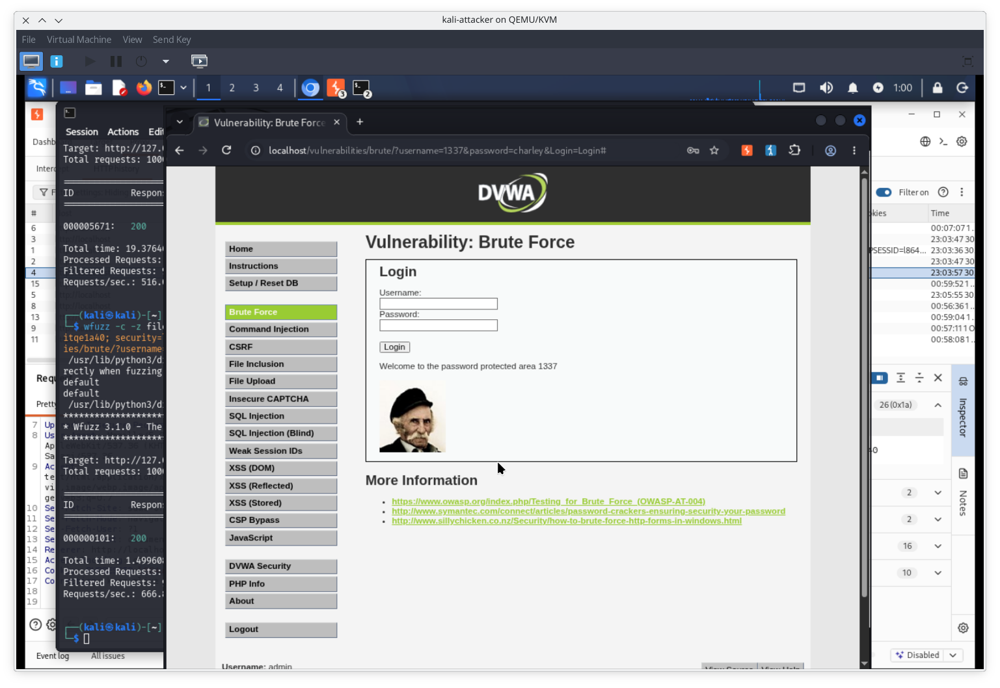

## Results Summary

| Username | Password | Found via | Wordlist (full path) | Notes |
|----------|----------|-----------|------------------------|-------|
| admin    | password | Burp Intruder cluster bomb | `/usr/share/wordlists/metasploit/http_default_pass.txt` | Confirmed via response length outlier (4740 vs 4703) |
| pablo    | letmein  | wfuzz | `/usr/share/wordlists/seclists/Passwords/Common-Credentials/Pwdb_top-1000.txt` | Hit on first attempt |
| smithy   | password | wfuzz | `/usr/share/wordlists/seclists/Passwords/Common-Credentials/Pwdb_top-1000.txt` | Hit on first attempt |
| gordonb  | abc123   | wfuzz | `/usr/share/wordlists/seclists/Passwords/Common-Credentials/Pwdb_top-1000.txt` | Hit on first attempt |
| 1337     | charley  | wfuzz | `/usr/share/wordlists/seclists/Passwords/Common-Credentials/Pwdb_top-10000.txt` | top-1000 had no hit; escalated to top-10000 |

**Usernames** were all found via ffuf against `/hackable/users/FUZZ.jpg`, wordlist: `/usr/share/seclists/Usernames/xato-net-10-million-usernames.txt`.

## Key Takeaways
- DVWA's Brute Force page always returns HTTP 200; detection requires filtering on response content/length, not status code.
- A targeted, purpose-built username wordlist (or a very large real-world one) is necessary for DVWA's intentionally unusual account names — generic "common username" lists miss most of them.
- Avatar/profile image endpoints (`/hackable/users/<name>.jpg`) are a reliable side-channel for username enumeration, distinct from the login form itself.
- Response length/line-count comparison (Burp Intruder's sortable results table, or wfuzz's `--hs` filter) is an effective way to spot a single successful login hidden among hundreds of identical failures.
- Escalating wordlist size only when a smaller one fails (as with `1337`) is a practical, time-efficient approach rather than always reaching for the largest list first.

